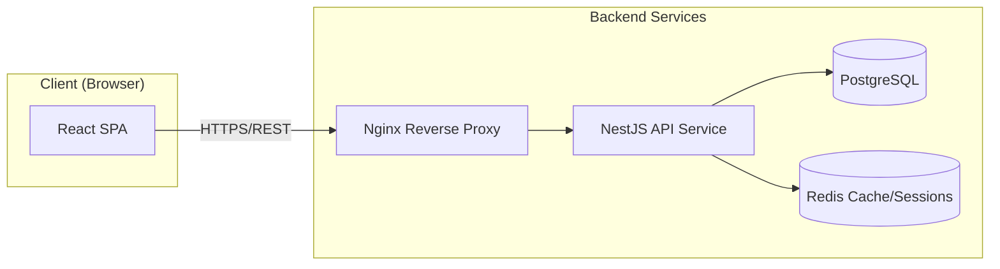
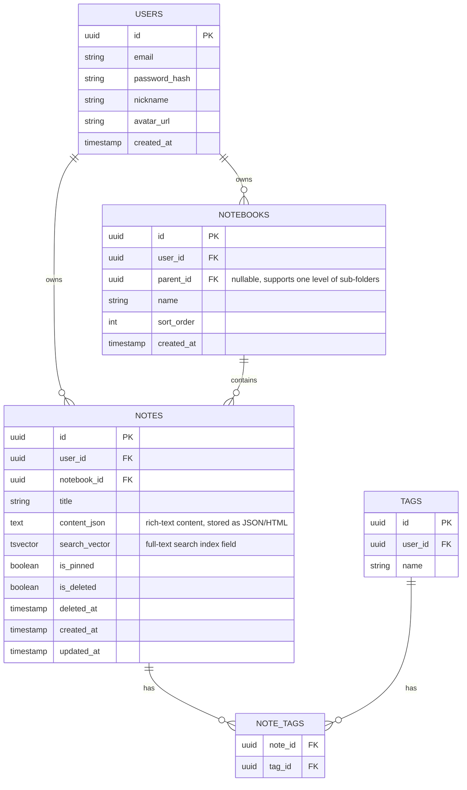

# Personal Notebook App — Technical Design Document

Version: v1.1　　Date: 2026-09-22　　Corresponding PRD: v1.1

## 1. Technology Stack

| Layer | Technology | Notes |
|---|---|---|
| Frontend | React + TypeScript + Vite | Component-based development, type safety |
| Rich-text editor | Tiptap (built on ProseMirror) | Mature, extensible rich-text solution with native Markdown-style shortcuts |
| State management | Zustand / React Query | Zustand for local UI state, React Query for server-data caching and syncing |
| Styling | Tailwind CSS | Fast responsive UI development |
| Backend | Node.js + NestJS (or Express) | NestJS provides a modular structure for easier future expansion |
| Database | PostgreSQL | Relational database with built-in full-text search (tsvector) and transactional safety |
| Full-text search | PostgreSQL's built-in full-text search (can later be swapped for Elasticsearch/Meilisearch) | No need for a dedicated search engine at this data scale |
| Cache | Redis (optional, P1) | Session cache, rate limiting |
| Auth | JWT (Access Token + Refresh Token) | Stateless auth, easy to scale horizontally |
| File storage | Object storage (e.g., S3 / OSS, reserved for image attachments, P2) | |
| Deployment | Docker + Docker Compose / Kubernetes (depending on scale) | Containerized frontend/backend, automated CI/CD |
| Hosting | Cloud VM + Nginx reverse proxy / Vercel (frontend) + managed cloud database | |

---

## 2. System Architecture



**Notes:**
- The frontend is a single-page application (SPA) that communicates with the backend over REST, with every request carrying a JWT.
- The backend uses a layered architecture: Controller (routing) → Service (business logic) → Repository (data access).
- The database handles core storage and full-text search; Redis handles auxiliary concerns like sessions/rate limiting (introduced in P1).

---

## 3. Database Design

### 3.1 ER Diagram (Simplified)



### 3.2 Key Tables
- **notes.content_json**: The editor content is stored as structured JSON (the Tiptap document model) for easy rendering and future extension; a plain-text copy is also kept to build `search_vector`.
- **notes.search_vector**: A PostgreSQL `tsvector` column paired with a GIN index to power full-text search; it's kept in sync with the title/body via a trigger or at the application layer whenever they change.
- **Soft delete**: `is_deleted` + `deleted_at` implement the trash bin; a scheduled job purges records where `deleted_at` is more than 30 days old.
- **notebooks.parent_id**: A self-referencing foreign key that supports one level of sub-folders.

### 3.3 Indexes
- `notes(user_id, notebook_id)` composite index: for listing notes by notebook
- `notes(user_id, is_deleted, updated_at)`: for list ordering and trash-bin queries
- `notes USING GIN(search_vector)`: for full-text search
- `note_tags(note_id)`, `note_tags(tag_id)`: for tag-relation lookups

---

## 4. API Design (RESTful)

Common prefix: `/api/v1`. Except for register/login, every request must carry `Authorization: Bearer <access_token>` in its headers.

### 4.1 Auth
| Method | Path | Description |
|---|---|---|
| POST | /auth/register | Register with email |
| POST | /auth/login | Log in, returns access_token + refresh_token |
| POST | /auth/refresh | Refresh the access_token |
| POST | /auth/logout | Log out, revokes the refresh_token |
| POST | /auth/password/forgot | Send a password-reset email |
| POST | /auth/password/reset | Reset the password |

### 4.2 Notebooks
| Method | Path | Description |
|---|---|---|
| GET | /notebooks | Get the notebook list (tree structure) |
| POST | /notebooks | Create a notebook |
| PATCH | /notebooks/:id | Rename/move a notebook |
| DELETE | /notebooks/:id | Delete a notebook (cascades: moves its notes into the trash) |

### 4.3 Notes
| Method | Path | Description |
|---|---|---|
| GET | /notes?notebookId=&tagId=&page=&pageSize= | Paginated note list |
| GET | /notes/:id | Get a single note's detail |
| POST | /notes | Create a note |
| PATCH | /notes/:id | Update a note (title/body/notebook — auto-save calls this endpoint) |
| DELETE | /notes/:id | Soft-delete a note (moves it to the trash) |
| POST | /notes/:id/restore | Restore a note from the trash |
| DELETE | /notes/:id/permanent | Permanently delete a note |
| PATCH | /notes/:id/pin | Pin/unpin a note |
| GET | /notes/:id/export | Export a note as Markdown |

### 4.4 Tags
| Method | Path | Description |
|---|---|---|
| GET | /tags | Get the tag list |
| POST | /tags | Create a tag |
| PATCH | /tags/:id | Rename a tag |
| DELETE | /tags/:id | Delete a tag |
| PUT | /notes/:id/tags | Set the full tag set for a note |

### 4.5 Search
| Method | Path | Description |
|---|---|---|
| GET | /search?q=&notebookId=&tagId= | Full-text search, returns matching notes with highlighted snippets |

### 4.6 Sample Request/Response

**PATCH /notes/:id**
```json
// Request
{
  "title": "Weekly meeting notes",
  "contentJson": { "type": "doc", "content": [ /* Tiptap document nodes */ ] }
}

// Response 200
{
  "id": "uuid",
  "title": "Weekly meeting notes",
  "updatedAt": "2026-09-22T10:00:00Z"
}
```

**GET /search?q=project**
```json
{
  "results": [
    {
      "noteId": "uuid",
      "title": "<em>Project</em> kickoff meeting",
      "snippet": "...the key milestones for this <em>project</em> include...",
      "notebookId": "uuid",
      "updatedAt": "2026-09-20T08:00:00Z"
    }
  ],
  "total": 1
}
```

---

## 5. Authentication & Security

- **Password storage**: bcrypt/argon2 salted hashing; no plaintext or reversible encryption is ever used.
- **Token scheme**: Access Token (short-lived, 15-30 minutes) + Refresh Token (long-lived, stored in an httpOnly cookie or secure storage, 7-30 days), with revocation support (a blacklist stored in Redis/DB).
- **Authorization enforcement**: Every notebook/note/tag query enforces a `user_id = current user` condition at the SQL layer to prevent IDOR (insecure direct object reference) vulnerabilities.
- **Transport security**: HTTPS site-wide, with HSTS.
- **Rate limiting**: Login and password-reset endpoints are rate-limited per IP and per account to prevent brute-force attacks (implemented with Redis).
- **Input validation**: The backend validates request bodies using DTOs + class-validator to prevent injection and malformed data.
- **XSS protection**: Rich-text content is whitelist-sanitized on render (e.g., with DOMPurify) to prevent stored XSS.

---

## 6. Frontend Structure (Brief)

```
src/
  api/            # API request wrappers (axios + React Query)
  components/     # Shared components (editor, note list item, sidebar, etc.)
  features/
    auth/         # Login/register pages
    notebooks/    # Notebook components and logic
    notes/        # Note editor, note list
    search/       # Search page
  store/          # Zustand global state (current user, UI state)
  routes/         # Route configuration (React Router)
```

**Auto-save implementation notes**: Editor content changes → debounce (1.5s) → call `PATCH /notes/:id` → show a "saved" status; on network failure, changes are held locally and retried, so nothing is lost.

---

## 7. Deployment

- Frontend: built as static assets, deployed to a CDN (e.g., Vercel or a cloud provider's CDN)
- Backend: containerized with Docker, orchestrated via Docker Compose (small scale) or Kubernetes (at scale), with Nginx handling reverse proxy and HTTPS termination
- Database: a managed cloud PostgreSQL service (automated backups, primary/replica)
- CI/CD: GitHub Actions — pushes to the main branch automatically run tests → build images → deploy
- Monitoring & logging: centralized log collection (e.g., Loki/ELK) with basic alerting (service liveness, error rate, latency)

---

## 8. Reserved for Future Extension

- Image/attachment upload: integrate object storage, reference attachments from note content
- Multi-level nested folders: `notebooks` already uses a self-referencing foreign key, so it can be smoothly extended to unlimited nesting
- Search upgrade: as data volume grows, this can be migrated to Elasticsearch/Meilisearch with no change to the API contract
- Multi-user collaboration: reserve design space for a sharing/permissions table on `notebooks`/`notes` (not implemented in this phase)
