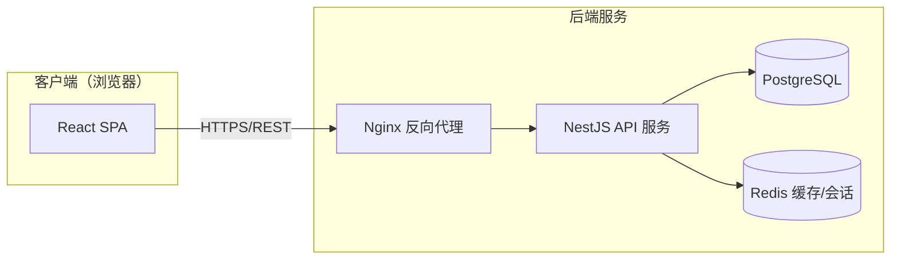
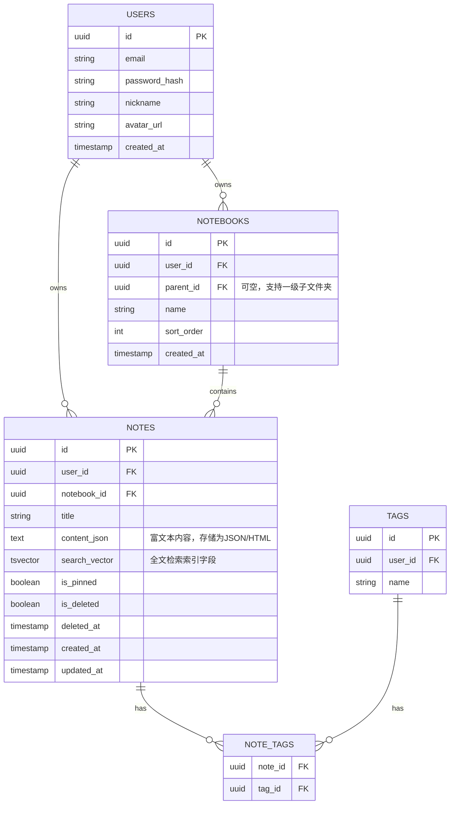

# 个人笔记应用 — 技术设计文档

版本：v1.0　　日期：2026-09-22　　对应需求文档：v1.0

## 1. 技术选型

| 层 | 技术 | 说明 |
|---|---|---|
| 前端 | React + TypeScript + Vite | 组件化开发，类型安全 |
| 富文本编辑器 | Tiptap（基于 ProseMirror） | 成熟、可扩展的富文本方案，原生支持 Markdown 风格快捷输入 |
| 状态管理 | Zustand / React Query | Zustand 管理本地 UI 状态，React Query 管理服务端数据缓存与同步 |
| 样式 | Tailwind CSS | 快速构建响应式界面 |
| 后端 | Node.js + NestJS（或 Express） | NestJS 提供模块化结构，便于后期扩展 |
| 数据库 | PostgreSQL | 关系型数据库，支持全文搜索（tsvector），事务安全 |
| 全文搜索 | PostgreSQL 内置全文检索（后期可替换为 Elasticsearch/Meilisearch） | 初期数据量下无需引入独立搜索引擎 |
| 缓存 | Redis（可选，P1） | 会话缓存、限流 |
| 认证 | JWT（Access Token + Refresh Token） | 无状态认证，便于水平扩展 |
| 文件存储 | 对象存储（如 S3 / OSS，为图片附件预留，P2） | |
| 部署 | Docker + Docker Compose / Kubernetes（视规模而定） | 前后端容器化部署，CI/CD 自动化 |
| 托管 | 云服务器 + Nginx 反向代理 / Vercel（前端）+ 云数据库 | |

---

## 2. 系统架构



**说明：**
- 前端为单页应用（SPA），通过 REST API 与后端通信，所有请求携带 JWT。
- 后端采用分层架构：Controller（路由）→ Service（业务逻辑）→ Repository（数据访问）。
- 数据库承担核心存储与全文检索，Redis 承担会话/限流等辅助能力（P1 引入）。

---

## 3. 数据库设计

### 3.1 ER 图（简化）



### 3.2 关键表说明
- **notes.content_json**：编辑器内容以结构化 JSON（Tiptap 文档模型）存储，便于渲染与后续扩展；同时冗余存一份纯文本用于生成 `search_vector`。
- **notes.search_vector**：PostgreSQL `tsvector` 字段，配合 GIN 索引实现全文搜索；标题与正文变更时通过触发器或应用层同步更新。
- **软删除**：`is_deleted` + `deleted_at` 实现回收站，定时任务清理 `deleted_at` 超过 30 天的记录。
- **notebooks.parent_id**：支持一级子文件夹，自引用外键。

### 3.3 索引设计
- `notes(user_id, notebook_id)` 复合索引：按笔记本查询列表
- `notes(user_id, is_deleted, updated_at)`：列表排序与回收站查询
- `notes USING GIN(search_vector)`：全文搜索
- `note_tags(note_id)`、`note_tags(tag_id)`：标签关联查询

---

## 4. API 设计（RESTful）

统一前缀：`/api/v1`，除注册/登录外均需在 Header 携带 `Authorization: Bearer <access_token>`

### 4.1 认证
| 方法 | 路径 | 说明 |
|---|---|---|
| POST | /auth/register | 邮箱注册 |
| POST | /auth/login | 登录，返回 access_token + refresh_token |
| POST | /auth/refresh | 刷新 access_token |
| POST | /auth/logout | 退出登录，吊销 refresh_token |
| POST | /auth/password/forgot | 发送重置密码邮件 |
| POST | /auth/password/reset | 重置密码 |

### 4.2 笔记本
| 方法 | 路径 | 说明 |
|---|---|---|
| GET | /notebooks | 获取笔记本列表（树形） |
| POST | /notebooks | 创建笔记本 |
| PATCH | /notebooks/:id | 重命名/移动笔记本 |
| DELETE | /notebooks/:id | 删除笔记本（级联处理内部笔记，移入回收站） |

### 4.3 笔记
| 方法 | 路径 | 说明 |
|---|---|---|
| GET | /notes?notebookId=&tagId=&page=&pageSize= | 分页获取笔记列表 |
| GET | /notes/:id | 获取单篇笔记详情 |
| POST | /notes | 创建笔记 |
| PATCH | /notes/:id | 更新笔记（标题/正文/所属笔记本，自动保存调用此接口） |
| DELETE | /notes/:id | 软删除笔记（进回收站） |
| POST | /notes/:id/restore | 从回收站恢复 |
| DELETE | /notes/:id/permanent | 彻底删除 |
| PATCH | /notes/:id/pin | 置顶/取消置顶 |
| GET | /notes/:id/export | 导出为 Markdown |

### 4.4 标签
| 方法 | 路径 | 说明 |
|---|---|---|
| GET | /tags | 获取标签列表 |
| POST | /tags | 创建标签 |
| PATCH | /tags/:id | 重命名标签 |
| DELETE | /tags/:id | 删除标签 |
| PUT | /notes/:id/tags | 设置笔记的标签集合 |

### 4.5 搜索
| 方法 | 路径 | 说明 |
|---|---|---|
| GET | /search?q=&notebookId=&tagId= | 全文搜索，返回命中笔记及高亮片段 |

### 4.6 请求/响应示例

**PATCH /notes/:id**
```json
// Request
{
  "title": "周会纪要",
  "contentJson": { "type": "doc", "content": [ /* Tiptap文档节点 */ ] }
}

// Response 200
{
  "id": "uuid",
  "title": "周会纪要",
  "updatedAt": "2026-09-22T10:00:00Z"
}
```

**GET /search?q=项目**
```json
{
  "results": [
    {
      "noteId": "uuid",
      "title": "项目<em>项目</em>启动会",
      "snippet": "……本次<em>项目</em>的关键里程碑包括……",
      "notebookId": "uuid",
      "updatedAt": "2026-09-20T08:00:00Z"
    }
  ],
  "total": 1
}
```

---

## 5. 认证与安全方案

- **密码存储**：bcrypt/argon2 哈希加盐存储，禁止明文/可逆加密。
- **Token 机制**：Access Token（短期，15-30分钟）+ Refresh Token（长期，存储于 httpOnly Cookie 或安全存储，7-30天），Refresh Token 支持吊销（存储于 Redis/DB 黑名单）。
- **越权防护**：所有笔记/笔记本/标签查询均在 SQL 层强制加 `user_id = 当前用户` 条件，避免 IDOR 漏洞。
- **传输安全**：全站 HTTPS，HSTS。
- **限流**：登录、密码重置接口做 IP + 账号维度限流，防暴力破解（Redis 实现）。
- **输入校验**：后端使用 DTO + class-validator 做请求体校验，防止注入与异常数据。
- **XSS 防护**：富文本内容渲染时对 HTML 做白名单过滤（如使用 DOMPurify），避免存储型 XSS。

---

## 6. 前端结构（简述）

```
src/
  api/            # 封装的 API 请求（基于 axios + React Query）
  components/     # 通用组件（编辑器、笔记列表项、侧边栏等）
  features/
    auth/         # 登录注册页
    notebooks/    # 笔记本相关组件与逻辑
    notes/        # 笔记编辑器、笔记列表
    search/       # 搜索页
  store/          # Zustand 全局状态（当前用户、UI状态）
  routes/         # 路由配置（React Router）
```

**自动保存实现要点**：编辑器内容变化 → 防抖（debounce 1.5s）→ 调用 `PATCH /notes/:id` → 显示"已保存"状态；网络失败时本地暂存并重试，避免数据丢失。

---

## 7. 部署方案

- 前端：构建为静态资源，部署至 CDN（如 Vercel/云厂商 CDN）
- 后端：Docker 容器化，通过 Docker Compose（小规模）或 Kubernetes（规模化）编排，Nginx 做反向代理与 HTTPS 终结
- 数据库：云数据库 PostgreSQL 托管服务（自动备份、主从）
- CI/CD：GitHub Actions，push 到主分支后自动跑测试 → 构建镜像 → 部署
- 监控与日志：接入日志采集（如 Loki/ELK）+ 基础告警（服务存活、错误率、延迟）

---

## 8. 后续扩展预留

- 图片/附件上传：接入对象存储，笔记内容中插入附件引用
- 多级文件夹嵌套：`notebooks` 表已用自引用外键设计，可平滑扩展为无限层级
- 搜索能力升级：数据量增长后可平滑迁移到 Elasticsearch/Meilisearch
- 多人协作：预留 `notebooks`/`notes` 的分享权限表设计空间（本期不实现）
